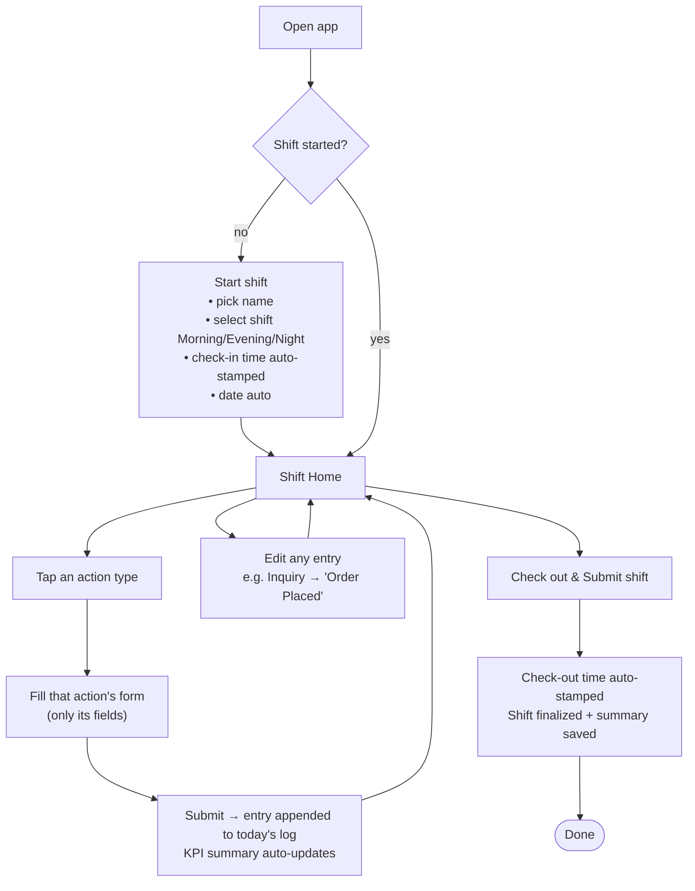
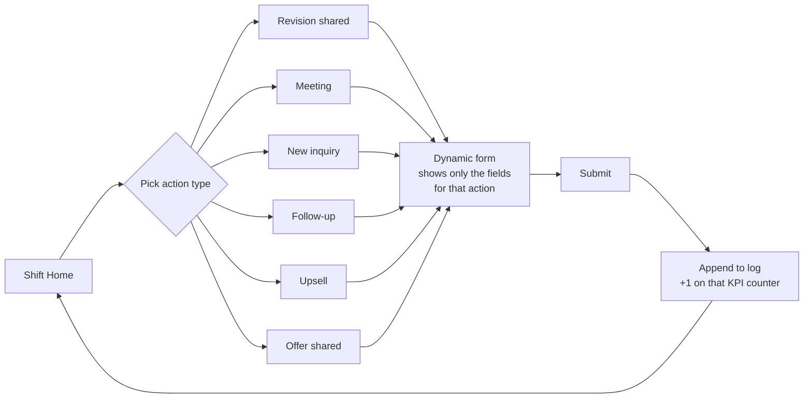
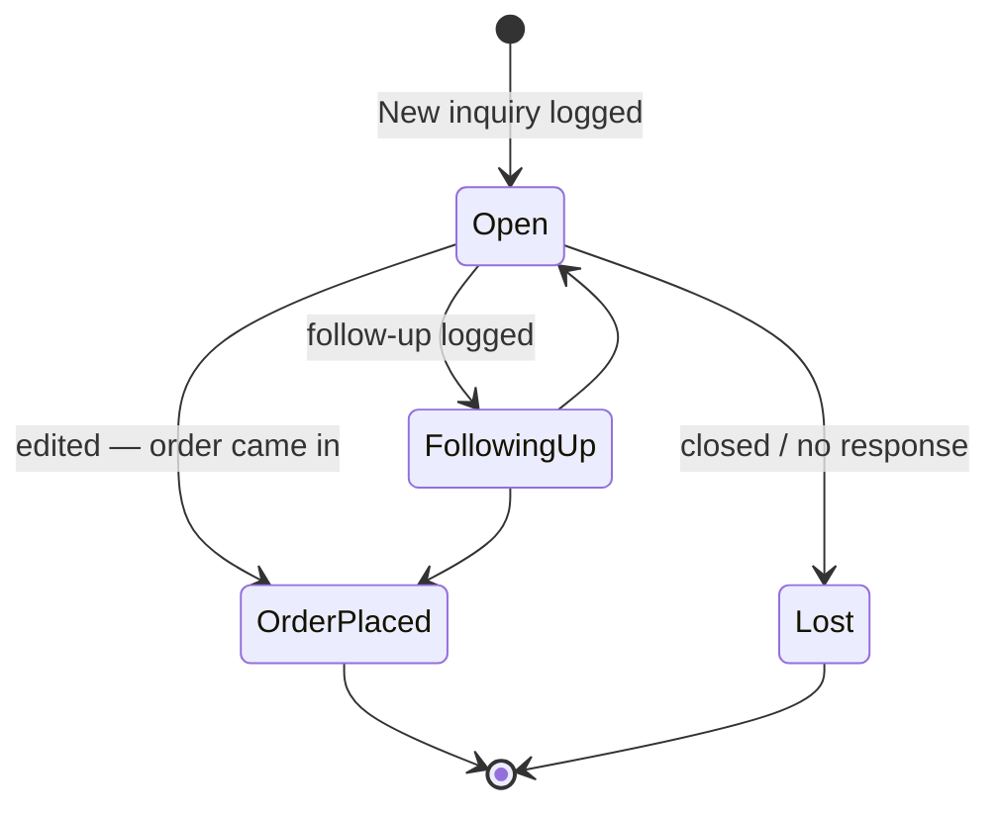
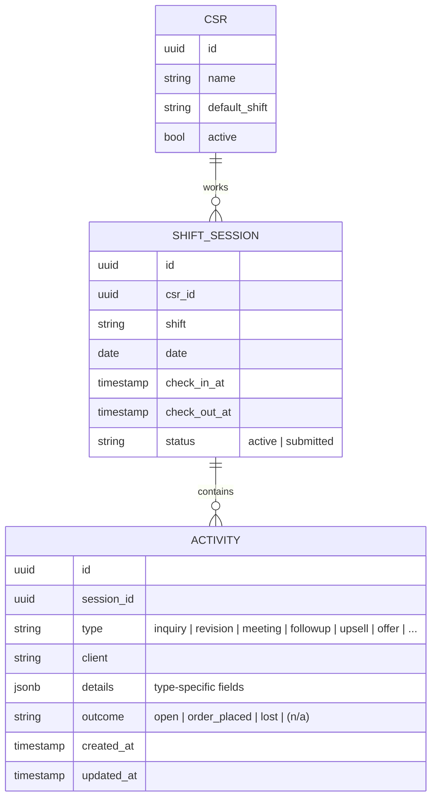
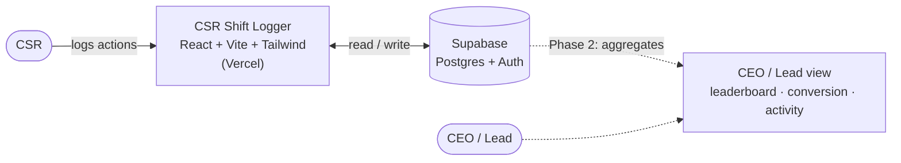

# CSR Shift Logger — System Design (for approval)

**Status:** DESIGN ONLY — nothing built yet. Approve / adjust, then we build.
**Working name:** CSR Shift Logger
**Owner:** Abdul Haseeb

> **Current design = v3** → see `CSR-Shift-Logger-Design.pdf` (source: `design-pdf/csr-shift-logger-v3.html`).
> v3 adds: a **read-only team log** (any CSR can read past shifts + KPIs, can't edit) and **hand-off notes**
> (each CSR leaves a note; the next CSR sees it as a pop-up at login and taps “Noted”). All copy rewritten in
> plain, non-technical English (13 pages). Earlier v2 notes:
> v2 changes from the draft below: identity = name + shift + profile (no CSR ID, **no conversion**) · PKT
> shift windows · **pop-up** logging (`+ → form → OK`) · full action catalog (meeting & inquiry **agenda**,
> project assigned + **project + due date**, spam **username**, **designer follow-up**) · shift **metrics &
> checklist** (impressions/clicks, CRM/ClickUp/portfolio/analytics) · **live** KPIs · two **separate**
> surfaces — CSR dashboard and a gated CEO/Manager console — on Supabase **Realtime**.
> The v1 sections below are kept for history.

---

## 1. What this is (and isn't)

A standalone web app where each CSR logs **every action they take during a shift** through
**structured input forms** — pick an action type, fill its specific fields, submit, repeat.
The app **auto-tallies** the KPI summary, so the CSR never types totals or free-text notes.

- **Self-contained.** It does **not** read from any sheet, CSR Pulse, or ClickUp. The CSRs'
  manual entries are the only data source. (CSRs are the sensors; the app is the log.)
- **Structured, not notes.** Every action is a typed event with defined fields — so it can be
  counted, filtered, and rolled up. This is the "capture structure at the point of action"
  principle, finally as a first-class input tool.
- **Editable.** An entry can be updated later (e.g., an inquiry that becomes an order).

> What replaces the manual chat report: the CSR logs actions as they happen → the app
> generates the shift summary automatically.

---

## 2. The CSR journey (screen flow)



---

## 3. Logging one action (the core loop)



---

## 4. Action catalog

**Confirmed (from your message)** — each is one button on Shift Home:

| # | Action | Fields | Notes |
|---|---|---|---|
| 1 | **New inquiry** | Username / Name | Has an editable **outcome** (see §5) |
| 2 | **Revision shared** | Fiverr username · Project name | |
| 3 | **Meeting** | Client name · Type (New meeting / Existing-client meeting) | |
| 4 | **Follow-up** | Client name · Follow-up type (Update / Lead / Re-engage) | |
| 5 | **Upsell** | Client name · What was upsold · New client / Old client | optional value |
| 6 | **Offer shared** | Client name · Scope of work · Offer value | optional coupon code |

**Candidates from your existing daily reports** — confirm which to include (these showed up in
the Ahmad / Saad / Basit / Nadir reports):

| Action | Fields |
|---|---|
| New order received | Client · Service / gig · Value |
| Delivery to client | Client · Project · Stage (Draft / Revision / Final) |
| Order / project assigned (to designer) | Client · Designer |
| Extension sent | Client · Reason |
| Completed order | Client · Value |
| Spam / irrelevant | count only |

> Decision: which of these six become buttons too? (Some — like "assigned to designer" —
> may already live in ClickUp; you said keep this app self-contained, so we'd re-log them here
> manually. Your call.)

---

## 5. The "edit later" rule — inquiry lifecycle

Entries aren't frozen. The clearest case: a logged inquiry later turns into an order.



This single field (an inquiry's **outcome**) is what later makes **conversion %** computable —
*inquiries that became orders ÷ all inquiries* — without any external data.

---

## 6. Data model



- One **session** per CSR per shift (check-in → check-out).
- Each **activity** is one logged action; its type-specific fields live in `details`, with
  `client` and `outcome` pulled out as real columns so they're filterable.
- The KPI summary = `count(activity) group by type` for the session — never typed.

---

## 7. Screen sketches (low-fi)

```
┌─ START SHIFT ───────────────────────────────┐
│  Name:   [ Saad            ▼ ]               │
│  Shift:  ( ) Morning ( ) Evening (•) Night   │
│  Date:   13 Jun 2026  (auto)                 │
│  Check-in: 21:30  (auto on Start)            │
│                         [  Start shift  ]    │
└──────────────────────────────────────────────┘

┌─ SHIFT HOME — Saad · Night · 13 Jun ────────┐
│  Inquiries 3 · Follow-ups 2 · Upsells 1 …    │  ← auto KPI bar
│                                              │
│  + New inquiry   + Revision shared           │
│  + Meeting       + Follow-up                 │  ← action buttons
│  + Upsell        + Offer shared              │
│  ───────────────────────────────────────    │
│  TODAY'S LOG                       (edit ✎)  │
│  • 21:34  Inquiry   david2clarke   [Open]    │
│  • 21:41  Upsell    @negoettsche   Old       │
│  • 21:52  Offer     Ascend Group   $70       │
│                                              │
│              [  Check out & submit shift  ]  │
└──────────────────────────────────────────────┘

┌─ NEW INQUIRY ───────────────────────────────┐
│  Username / name:  [ david2clarke         ]  │
│  Outcome:          [ Open ▼ ] (edit later)   │
│                    [ Cancel ]  [  Save  ]    │
└──────────────────────────────────────────────┘
```

---

## 8. Architecture (proposed)



- **Frontend:** React + Vite + Tailwind — same stack you already ship on Vercel.
- **Storage:** **Supabase** (hosted Postgres). A shared backend is required — many CSRs writing,
  the CEO reading one combined picture. (localStorage can't do multi-user; sheets you've ruled out.)
- **Auth:** pick-your-name (no per-CSR password) **+ one shared team passcode** to open the app.
  Note: without per-person login the data store is open to anyone with the URL + passcode, so
  Supabase Row-Level Security will allow inserts/edits but block destructive wipes.
- **CEO/lead dashboard:** built **together** with the input app — read-only views over the same
  data (conversion from inquiry→order_placed, per-CSR activity, per-shift rollup, exception line).

---

## 9. Build phases

1. **Phase 1 — CSR input app.** Start-shift, action forms (the confirmed set), today's log,
   edit, auto-summary, check-out. Supabase + auth. **← what you asked for.**
2. **Phase 2 — CEO / lead dashboard.** Aggregations over the logged data.

---

## 10. Decisions — RESOLVED (approved 13 Jun)

1. **Storage = Supabase** (hosted Postgres). Data cannot live in the code/GitHub: a Vercel app
   is read-only at runtime and GitHub is not a database (every submit would be a git commit —
   slow, insecure, collides on concurrent writes). Supabase is the simplest shared store and
   does not change the Vercel deploy. Free tier is sufficient.
2. **Action catalog:** the 6 confirmed **+** the report candidates (New order, Delivery,
   Assigned-to-designer, Extension, Completed order, Spam). All become buttons in v1.
3. **Identify:** pick-your-name (no per-CSR password) **+ one shared team passcode** to open
   the app (light guard, since no login means the URL is otherwise open).
4. **Scope:** build the **CSR input app AND the CEO/lead dashboard together**.
5. **Check-in:** auto-stamped on "Start shift". **Edit window:** through end of the business day.

Still useful to share: your exact full action list (to confirm fields for the candidate actions
like deliveries/assignments), and 1–2 real shift reports for the trickier ones.
